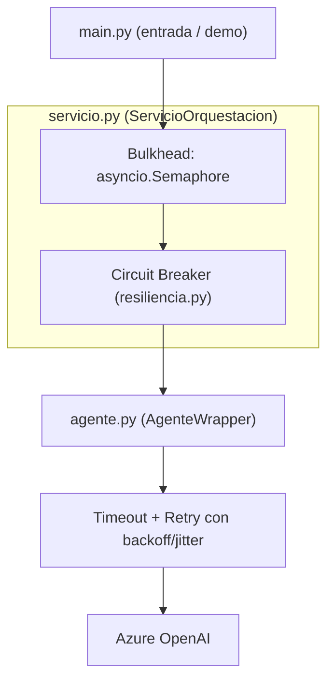

# Lab 13 - Arquitectura limpia para invocar agentes en producción

Este laboratorio no viene de `mslearn-ai-agents`. Complementa el
[lab12](../lab12/README.md) (que se enfoca solo en el patrón Retry) mostrando
cómo **estructurar en capas** una aplicación que invoca un modelo/agente, y
qué otras técnicas de resiliencia estándar se combinan con el retry para
que el sistema aguante carga real en producción, no solo una demo.

## Separación de responsabilidades: capas



- **`agente.py` (agent wrapper)**: la única pieza que sabe hablar con el
  modelo. Solo se encarga de *cómo* se hace una llamada individual:
  aplica **timeout** (no esperar indefinidamente) y **retry con backoff
  exponencial + jitter** ante 429 (ver el patrón Retry explicado a fondo
  en [lab12](../lab12/README.md)). No sabe nada de concurrencia ni de
  fallos históricos del servicio.
- **`resiliencia.py`**: contiene el **Circuit Breaker**, un componente de
  resiliencia genérico y reutilizable, sin ninguna referencia al modelo.
- **`servicio.py` (service layer)**: la capa de orquestación. Decide *qué*
  hacer con cada solicitud: la pasa por un **Bulkhead** (límite de
  concurrencia) y por el **Circuit Breaker** antes de delegarle la
  llamada real al agent wrapper.
- **`main.py`**: el punto de entrada que arma todo y lo demuestra.

Esta separación es la que permite, por ejemplo, cambiar de modelo o de
proveedor en `agente.py` sin tocar ninguna regla de negocio ni de
resiliencia definida en `servicio.py`, o reusar el `CircuitBreaker` de
`resiliencia.py` para proteger cualquier otra llamada (no solo al modelo).

## Las técnicas de resiliencia usadas

### 1. Retry con backoff exponencial + jitter

Ya cubierto en detalle en [lab12](../lab12/README.md). Resuelve fallas
**transitorias** (como un 429): asume que si esperás un poco y
reintentás, es probable que funcione.

Fuente: [Retry pattern - Azure Architecture Center](https://learn.microsoft.com/azure/architecture/patterns/retry).

### 2. Timeout

Ninguna llamada de red debería esperar indefinidamente: si el servicio
está lento o colgado, un timeout corta la espera para liberar recursos
(memoria, conexiones) en vez de dejarlos bloqueados. Se configura en
`agente.py` como `timeout=` al crear el cliente.

### 3. Circuit Breaker (`resiliencia.py`)

El Retry asume que reintentar eventualmente va a funcionar. El Circuit
Breaker resuelve el caso contrario: cuando un servicio lleva **varios
fallos seguidos**, seguir reintentando solo desperdicia tiempo y agrega
carga a un sistema que ya está degradado. El circuito tiene 3 estados:

- **Cerrado**: deja pasar las llamadas normalmente y cuenta los fallos.
- **Abierto**: al superar el umbral de fallos, rechaza toda llamada de
  inmediato (sin ni siquiera intentarla) durante un tiempo fijo.
- **Semi-abierto**: pasado ese tiempo, deja pasar una llamada de prueba;
  si funciona, vuelve a cerrado; si falla, vuelve a abierto.

Fuente: [Circuit Breaker pattern - Azure Architecture Center](https://learn.microsoft.com/azure/architecture/patterns/circuit-breaker).

### 4. Bulkhead / control de concurrencia (`servicio.py`)

Limita cuántas llamadas concurrentes puede hacer la aplicación al mismo
tiempo (acá con un `asyncio.Semaphore`), para que un pico de solicitudes
no agote la cuota del despliegue ni los recursos locales, aislando el
"presupuesto" de llamadas al modelo del resto de la aplicación.

Fuente: [Bulkhead pattern - Azure Architecture Center](https://learn.microsoft.com/azure/architecture/patterns/bulkhead)
y [Throttling pattern - Azure Architecture Center](https://learn.microsoft.com/azure/architecture/patterns/throttling)
(el control de concurrencia del lado del cliente complementa el
throttling que aplica el servicio del lado del servidor).

## Ejecutar

Reutiliza el `.env` de la raíz del repo
(`AZURE_OPENAI_ENDPOINT`, `AZURE_OPENAI_API_KEY`, `AZURE_OPENAI_DEPLOYMENT`):

```bash
source .venv/bin/activate
python lab13/main.py
```

La primera demo (`demo_bulkhead`) hace 4 preguntas reales en paralelo con
un límite de 2 concurrentes, para ver cómo el semáforo pone en cola las
que exceden ese límite. La segunda (`demo_circuit_breaker`) usa una
función simulada que siempre falla (sin llamar al modelo, para no gastar
cuota) para mostrar los 3 estados del circuito de punta a punta.
